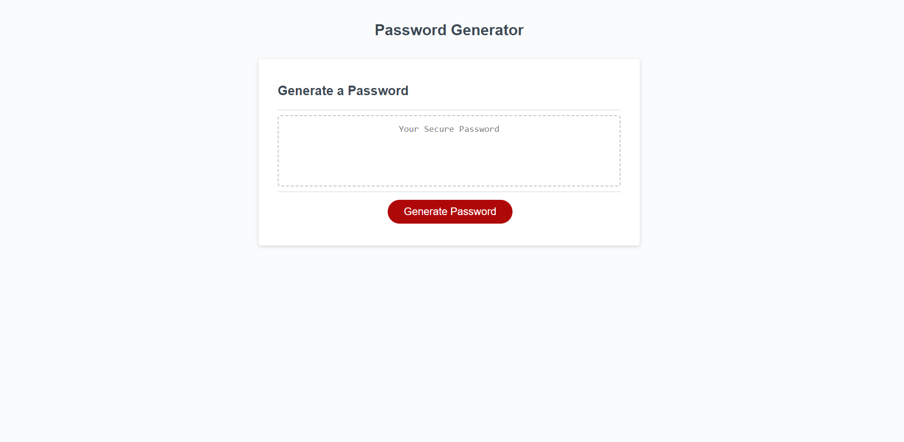
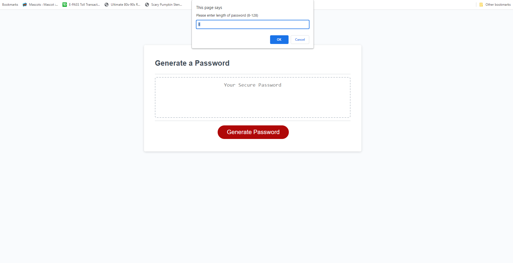
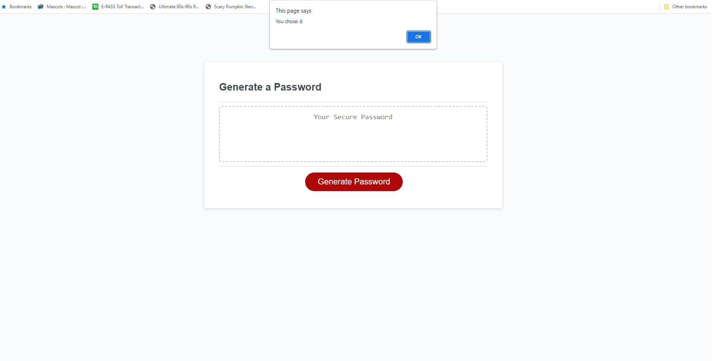
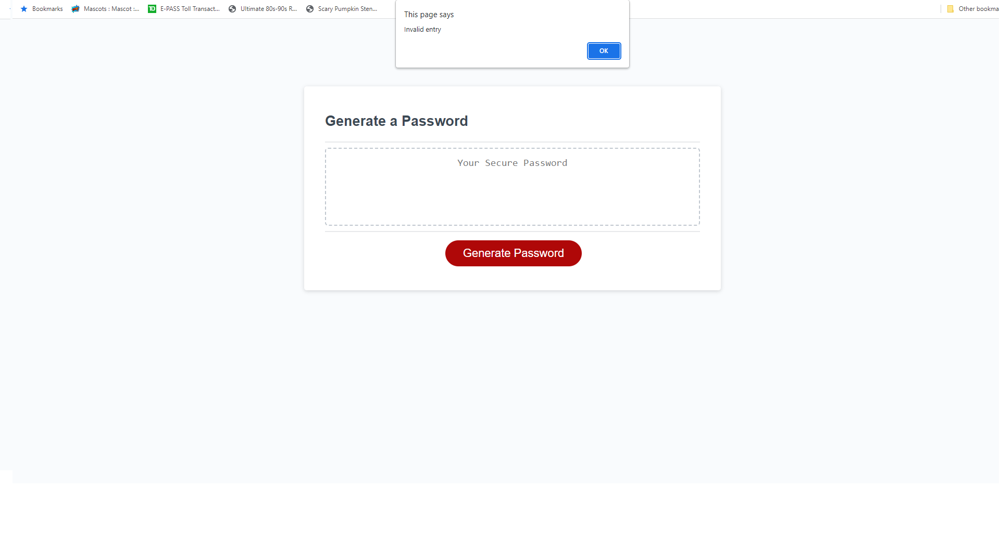
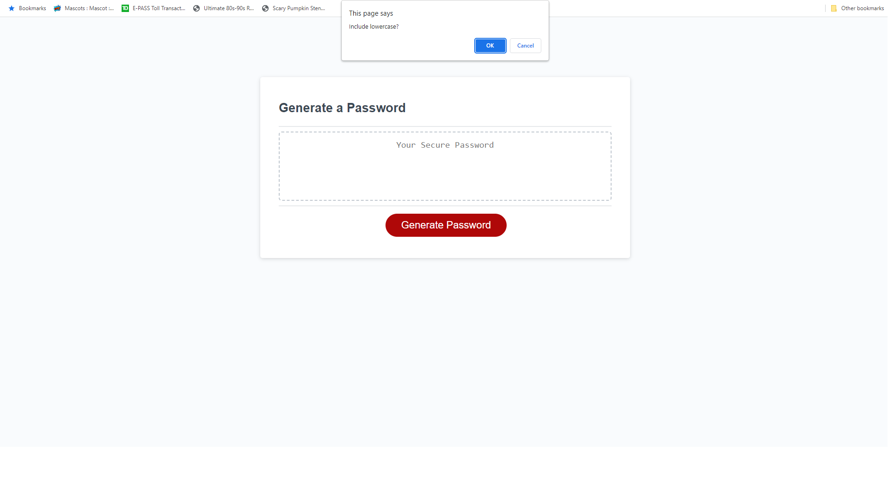
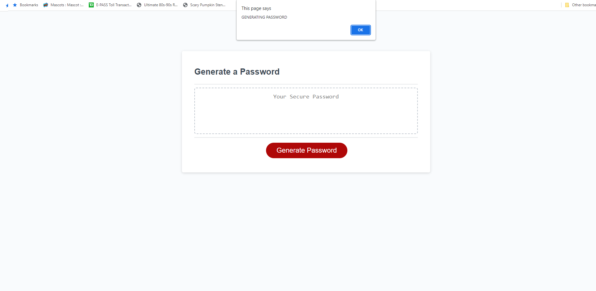
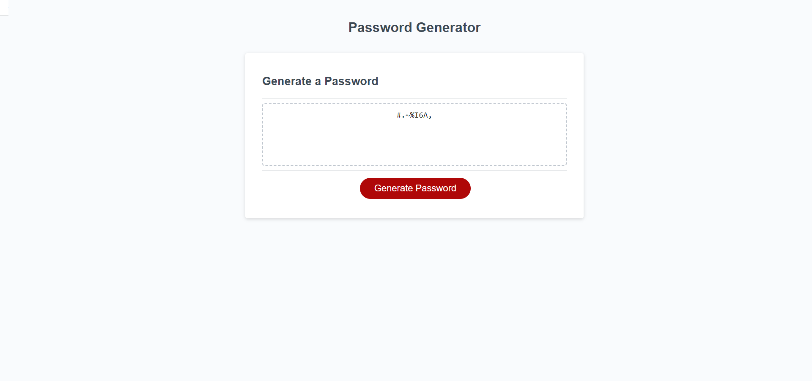

# Random Password Generator Website

A marketing agency wants a codebase that follows accessibility standards so that their site is optimized for search engines

## Viewed the source code; Started implementing functionality

* Upon first look of the javascript code there were no functions to generate a random password. I created several functions to process inputs that may be available for change and updating futuristically as well.

## Error detection; Making sure code would not crash

* I implemented several error checking spots to make sure the code would not crash and caring through with its purpose.

## Additional added items for accessibility

* Added link to top of page to heart icon on bottom of page
* Added link to top of page to Search Engine Optimization image
* Added link to top of page to Online Reputation Management
* Added link to top of page to Social Media Marketing

# Links to deployed application

## GitHub repository for Challenge One
[Github Repo](https://github.com/Quaz711/Module-One.git)

## Live website for Challenge One
[Live Website](https://quaz711.github.io/Module-One/)